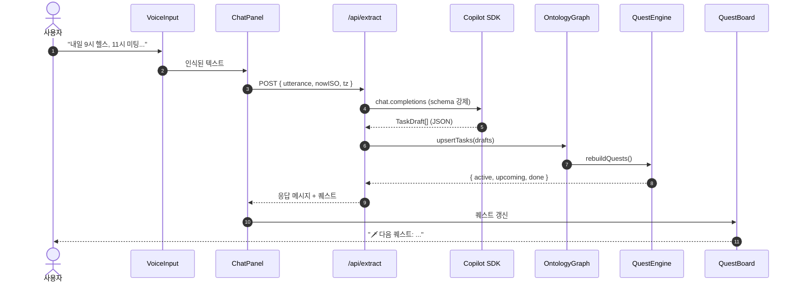

# 시스템 아키텍처

> 프로젝트: **스케줄게이미피케이션** (`schedule-gamification`)
> 두 개의 라우트(`/`, `/admin`)가 **하나의 도메인 코어 + 하나의 상태 저장소**를 공유한다.

## 1. 컴포넌트 다이어그램

```mermaid
flowchart LR
    User([🎤 사용자 발화])
    subgraph FE[Angular App - Standalone + Zoneless]
        Mic[VoiceInputComponent<br/>Web Speech via SpeechRecognizerPort]
        Chat[ChatPanelComponent]
        Quest[QuestBoardComponent]
        Char[CharacterCardComponent]
        subgraph AdminUI[/admin 콘솔/]
            Timeline[UtteranceTimelineComponent]
            Intent[IntentAnalyzerComponent]
            Graph[OntologyGraphViewComponent]
            Triples[TripleStoreTableComponent]
            Trace[QuestBuildTraceComponent]
        end
        ExtSvc[ExtractService<br/>@Injectable]
        Store[(ScheduleStore + AdminLogStore<br/>**Signals only**<br/>+ LocalStorage adapter)]
    end
    subgraph BE[Server - Express in server.ts]
        Extract[/POST /api/extract/]
    end
    subgraph AI[AI Layer]
        Copilot[Copilot SDK<br/>chat.completions]
        Prompt[Schema-locked<br/>Prompt Template]
    end
    subgraph Domain[Domain Core - Pure TS]
        Onto[OntologyGraph]
        QuestEng[QuestEngine<br/>+ strategies]
        XP[XpCalculator]
    end

    User --> Mic --> Chat
    Chat -->|user msg| Store
    Chat --> ExtSvc -->|HttpClient| Extract
    Extract --> Prompt --> Copilot --> Extract
    Extract -->|TaskDraft[] JSON| ExtSvc
    ExtSvc -->|ingestTasks| Store
    Store -. computed .-> QuestEng
    QuestEng --> Onto
    Store -. computed .-> XP
    Store -.구독(signal).-> Quest
    Store -.구독(signal).-> Char
    Store -.구독(signal).-> Timeline
    Store -.구독(signal).-> Intent
    Store -.구독(signal).-> Graph
    Store -.구독(signal).-> Triples
    Store -.구독(signal).-> Trace
```

**핵심 원칙**: `/admin`은 백엔드를 추가로 호출하지 않는다. 사용자 화면이 만든 변화는 공유 Signal Store에 적재되고, 관리자 패널들은 해당 signal을 구독하여 자동으로 다시 그려진다.

## 2. 레이어 분리 (SOLID)

| 레이어 | 책임 | 의존성 방향 |
|---|---|---|
| **UI Component** (`features/**`) | Signal 구독 + 사용자 입력 위임. 표시만. | → State / Service |
| **State Store** (`state/*.store.ts`) | Signal 상태 보관 + computed 파생 | → Domain, Ports |
| **Use-case Service** (`services/*.service.ts`) | 호출 오케스트레이션, 포트 위임 | → Domain, Ports |
| **Domain** (`domain/**`) | 순수 비즈니스 규칙 (온톨로지, 퀘스트, XP) | 의존 없음 |
| **Ports** (`ports/**`) | 추상 인터페이스 + `InjectionToken` | 의존 없음 |
| **Adapters** (`adapters/**`) | 외부 시스템 구현(HTTP, 음성, 시계, 저장소) | → Ports(구현) |
| **Server** (`server/**`) | Copilot SDK 호출, 시크릿 관리, JSON 스키마 검증 | Node 전용 |

Domain 계층은 **Angular 없이 동작하는 순수 TypeScript** 로 유지한다. 상세한 규칙은 [11-angular-solid-guide.md](11-angular-solid-guide.md).

## 3. 데이터 흐름 (시퀀스)



## 4. 상태 관리 전략 (Signals 전용)

- 공유 상태는 전적으로 **Angular Signals**: `ScheduleStore` / `AdminLogStore` (둘 다 `@Injectable({providedIn:'root'})`).
- 컴포넌트는 store 의 readonly signal/computed 만 구독한다. 직접 쓰기·계산 금지.
- 서버는 stateless. 매 요청이 독립적으로 엔드포인트 계약을 채움(그래프 머지는 클라이언트의 store 안에서 수행).
- 영속화는 `LocalStoragePort` 어댑터 + store 내 `effect()` 1개. 멀티쓰레드 복잡도를 안 만든다.
- 상세 예제는 [11-angular-solid-guide.md §3](11-angular-solid-guide.md#3-signal-기반-상태-컨테이너-패턴) 참조.

## 5. 폴더 구조 (요약)

```
src/app/
  features/
    chat/           # /
    admin/          # /admin
  state/            # ScheduleStore, AdminLogStore (Signals)
  services/         # ExtractService, QuestService
  domain/           # OntologyGraph, QuestEngine, XpCalculator (순수 TS)
  ports/            # LLM_EXTRACTOR, CLOCK, SPEECH ... InjectionToken
  adapters/         # CopilotExtractor, WebSpeechRecognizer, LocalStorageStore
  app.config.ts     # DI 등록
server.ts           # Express + Angular SSR
server/api/         # /api/extract 핸들러
server/copilot/     # SDK 클라이언트, 프롬프트, 스키마
docs/               # 본 문서
```

완전한 폴더 트리는 [08-tech-stack.md §2](08-tech-stack.md#2-폴더-구조) 참조.

## 6. 배포

- **단일 노드 서버** 배포(`npm run serve:ssr`). Angular SSR 핵심이 Express와 함께 실행 되며 `/api/*` 에 LLM 프록시 역할 포함.
- 서버만 시크릿(`COPILOT_API_KEY`)을 읽는다. 클라이언트 번들에 **절대 노출 X**.
