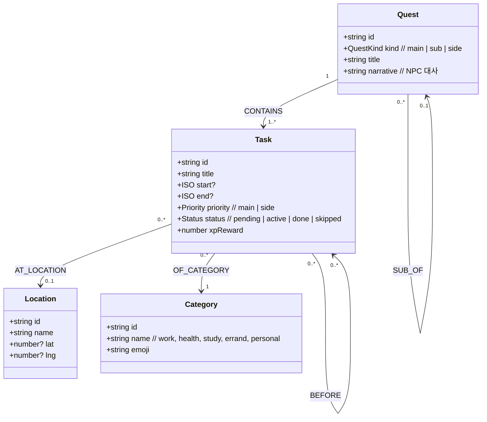
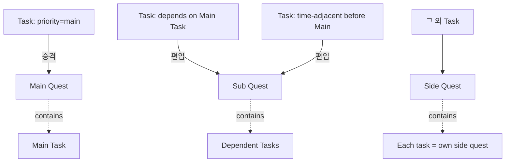
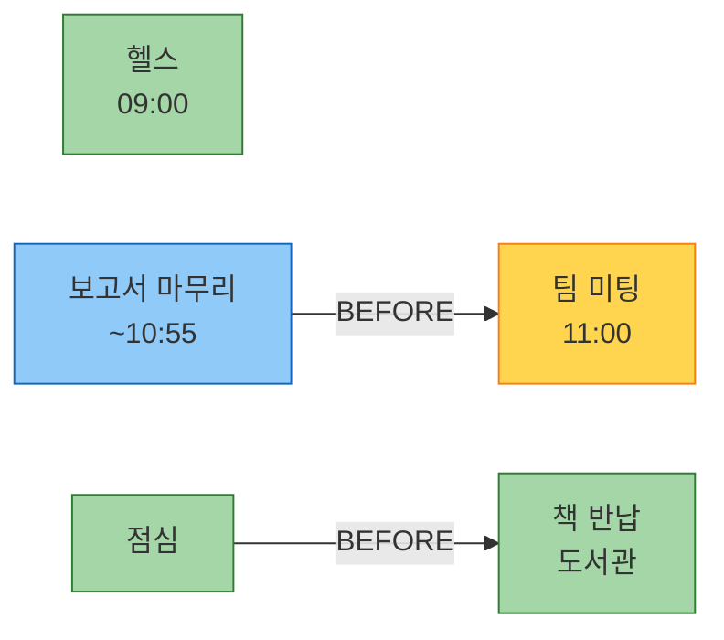

# 온톨로지 설계 (Core)

> QuestLog의 차별 포인트. 단순 To-do 배열이 아니라
> **"행위(Task) - 시간 - 장소 - 카테고리 - 선후관계"** 를 의미적으로 표현한다.

## 1. 클래스 다이어그램



## 2. 트리플 표현 (RDF 스타일)

내부적으로는 트리플 `(subject, predicate, object)` 로 단순 저장한다.

```
(task:t1, rdf:type, qlog:Task)
(task:t1, qlog:title, "보고서 초안 마무리")
(task:t1, qlog:end, "2026-06-21T10:55:00+09:00")
(task:t1, qlog:before, task:t2)
(task:t2, qlog:title, "팀 미팅")
(task:t2, qlog:atLocation, loc:meeting_room_A)
(task:t2, qlog:ofCategory, cat:work)
(task:t2, qlog:priority, "main")
```

이 표현은 future-proof 하다(추후 SPARQL/Cypher 이관 용이). 대회 MVP에서는 `Map<TripleKey, Set<value>>` 로 메모리 구현.

## 3. TypeScript 타입 정의

```ts
// lib/domain/types.ts
export type Priority = 'main' | 'side';
export type Status = 'pending' | 'active' | 'done' | 'skipped';
export type CategoryName = 'work' | 'health' | 'study' | 'errand' | 'personal';

export interface Task {
  id: string;
  title: string;
  start?: string;   // ISO8601
  end?: string;
  priority: Priority;
  status: Status;
  categoryId: string;
  locationId?: string;
  dependsOn: string[];  // task ids that must finish first
  xpReward: number;
  createdAt: string;
}

export interface Location { id: string; name: string; lat?: number; lng?: number; }
export interface Category { id: string; name: CategoryName; emoji: string; }

export type QuestKind = 'main' | 'sub' | 'side';
export interface Quest {
  id: string;
  kind: QuestKind;
  title: string;
  narrative: string;     // NPC 대사
  taskIds: string[];
  parentQuestId?: string;
}
```

## 4. OntologyGraph API

```ts
// lib/domain/ontology.ts
export class OntologyGraph {
  upsertTask(task: Task): void;
  removeTask(id: string): void;
  getTask(id: string): Task | undefined;

  // 의미 추론
  tasksAtLocation(locationId: string): Task[];
  tasksOfCategory(cat: CategoryName): Task[];
  predecessorsOf(taskId: string): Task[];
  successorsOf(taskId: string): Task[];

  // 시간 기반 암시적 순서
  inferImplicitOrder(): void;   // start 시각 기준 BEFORE 엣지 자동 추가

  // 직렬화
  toJSON(): GraphSnapshot;
  static fromJSON(snap: GraphSnapshot): OntologyGraph;
}
```

## 5. 일관성/정합성 규칙

| 규칙 | 처리 |
|---|---|
| 사이클 금지 | `dependsOn` 추가 시 DFS로 사이클 검출, 발견 시 거부 |
| 시간 모순 | `A.before(B)` 인데 `A.start > B.start` 면 경고 로그, 의존성 우선 |
| 장소 정규화 | 문자열 비교 시 trim + lowercase → 동일 Location id 매핑 |
| 카테고리 미분류 | LLM이 못 정하면 `personal` 기본값 |

## 6. 퀘스트 변환 규칙



알고리즘 의사코드:

```
function buildQuests(graph):
    quests = []
    for task in graph.tasks where priority='main':
        mq = new Quest(kind='main', taskIds=[task.id])
        for pred in graph.predecessorsOf(task.id):
            quests.push(new Quest(kind='sub', parent=mq.id, taskIds=[pred.id]))
        quests.push(mq)
    for task in graph.tasks not yet in any quest:
        quests.push(new Quest(kind='side', taskIds=[task.id]))
    return quests
```

## 7. 활성 퀘스트 결정 (`getActiveQuest`)

```
input: now, quests[], graph
1. 후보 = 모든 quest 중 status != done 인 첫 Task가
   - start <= now + 30min 이고
   - 모든 dependsOn 이 done
2. 우선순위: kind=sub > main > side
3. start가 더 가까운(또는 지난) 퀘스트 우선
4. 동점이면 main category > others
```

## 8. 예시 그래프

발화: *"내일 9시 헬스, 11시 팀 미팅, 미팅 전에 보고서 마무리, 점심 먹고 도서관에서 책 반납"*


