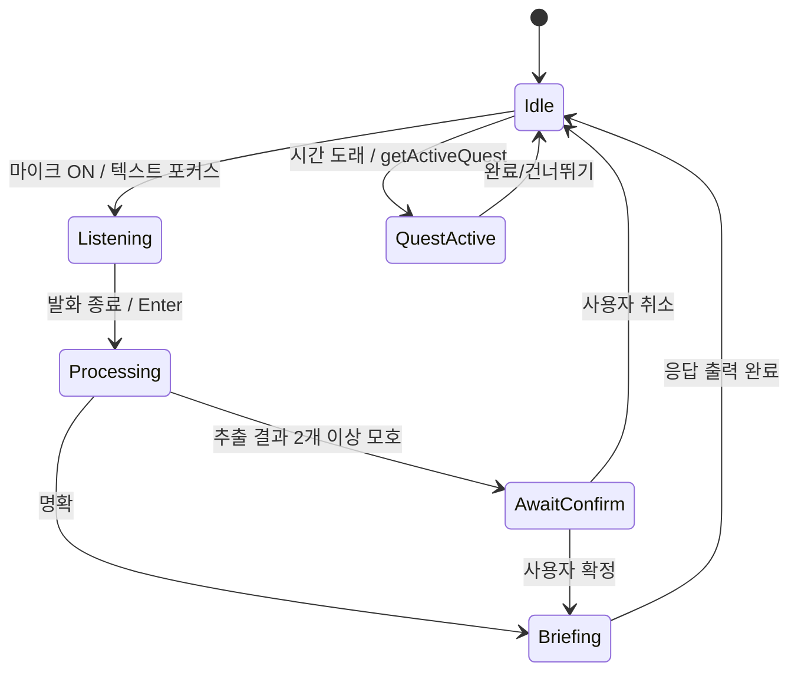

# 챗봇 대화 흐름 & 프롬프트 설계

## 1. 대화 상태 머신



## 2. 인텐트 분류 (간단)

| 인텐트 | 트리거 발화 예 | 처리 |
|---|---|---|
| `add_schedule` | "내일 9시 헬스..." | LLM 추출 → graph upsert |
| `complete_quest` | "끝", "완료", "다 했어" | activeQuest.status=done, XP++ |
| `skip_quest` | "건너뛰어", "패스" | status=skipped |
| `next_quest` | "다음", "뭐 하지" | getActiveQuest 재계산 후 안내 |
| `query` | "오늘 뭐 남았어?" | 남은 퀘스트 요약 |
| `cancel` | "취소", "그거 빼줘" | 가장 최근 추가 task 제거 |

> MVP에서는 LLM 한 번 호출로 `{intent, payload}` 까지 함께 추출한다(2단계 호출 X).

## 3. 핵심 프롬프트 (extract)

### 3.1 시스템 프롬프트

```
You are QuestLog's schedule parser. The user speaks Korean about their schedule.
Your job: extract structured tasks AND classify the intent.

REQUIREMENTS
- Output ONLY valid JSON matching the provided JSON Schema.
- Resolve relative time using `nowISO` (the user's local time) and `tz`.
- A single utterance can contain multiple tasks.
- Infer `dependsOn` when phrases like "...전에", "...끝나고", "...후에" are used.
- priority="main" if it sounds like a high-stakes commitment (meeting, exam, deadline, appointment).
- priority="side" otherwise.
- category: one of work, health, study, errand, personal.
- If intent is not add_schedule, set tasks=[] and only fill `intent`.

INTENT VALUES
- add_schedule | complete_quest | skip_quest | next_quest | query | cancel

Never invent specific times the user did not state; leave them null instead.
```

### 3.2 JSON Schema (Copilot SDK `response_format`)

```json
{
  "type": "object",
  "required": ["intent", "tasks", "npcReply"],
  "properties": {
    "intent": {
      "type": "string",
      "enum": ["add_schedule","complete_quest","skip_quest","next_quest","query","cancel"]
    },
    "tasks": {
      "type": "array",
      "items": {
        "type": "object",
        "required": ["title","priority","category"],
        "properties": {
          "title":     { "type": "string" },
          "start":     { "type": ["string","null"], "description": "ISO8601 with tz" },
          "end":       { "type": ["string","null"] },
          "location":  { "type": ["string","null"] },
          "priority":  { "type": "string", "enum": ["main","side"] },
          "category":  { "type": "string", "enum": ["work","health","study","errand","personal"] },
          "dependsOnTitles": {
            "type": "array",
            "items": { "type": "string" },
            "description": "Titles of OTHER tasks in THIS utterance that must finish before this one"
          }
        }
      }
    },
    "npcReply": {
      "type": "string",
      "description": "Single Korean sentence in NPC tone, addressing the user as 모험가/용사."
    }
  }
}
```

### 3.3 사용자 프롬프트 템플릿

```
nowISO: {{nowISO}}
tz: {{tz}}
utterance: """{{utterance}}"""
```

## 4. 대화 예시 (해피 패스)

```
👤 "내일 아침 9시에 헬스, 11시에 팀 미팅, 미팅 전에 보고서 마무리해줘."

🛠 LLM 추출:
{
  "intent": "add_schedule",
  "tasks": [
    { "title":"헬스", "start":"2026-06-21T09:00:00+09:00", "priority":"side", "category":"health" },
    { "title":"팀 미팅", "start":"2026-06-21T11:00:00+09:00", "priority":"main", "category":"work" },
    { "title":"보고서 마무리", "end":"2026-06-21T10:55:00+09:00", "priority":"side",
      "category":"work", "dependsOnTitles":[] }
  ],
  "npcReply": "용사여, 내일의 임무 3개를 퀘스트 보드에 새겼다네. 09시 헬스부터 출발이네."
}

📜 시스템:
- t1(헬스), t2(팀 미팅, main), t3(보고서)
- 시간 추론: t3.end < t2.start → t3 BEFORE t2 자동 추가
- 퀘스트 생성: Main(t2) + Sub(t3) + Side(t1)

🧙 NPC:
"용사여, 내일의 임무 3개를 퀘스트 보드에 새겼다네. 09시 헬스부터 출발이네."
```

## 5. 대화 예시 (완료/다음)

```
👤 "헬스 끝!"

🛠 intent=complete_quest, target=가장 최근 active 또는 매칭되는 title
   → t1.status=done, XP +10

🧙 NPC: "퀘스트 클리어! +10 XP. 다음은 보고서 두루마리일세."
```

## 6. 에러/엣지 처리

| 상황 | 처리 |
|---|---|
| LLM JSON 파싱 실패 | 1회 재시도 → 실패 시 "조금만 더 또렷이 말씀해 주시겠어요?" |
| 시간이 모호("이따") | start=null로 저장, NPC가 "언제쯤이신지 알려주시면 보드에 시각을 새기겠습니다" |
| 중복 일정(같은 title+같은 start) | upsert 정책으로 덮어쓰기, NPC 안내 |
| 빈 발화/노이즈 | 무시, 마이크 다시 활성화 |

## 7. 음성 인식 ↔ 챗 통합 팁
- `SpeechRecognition.continuous=false`, `interimResults=true` 로 실시간 미리보기.
- 발화 종료 감지: 마지막 음절 후 1.2초 무음 + `onend` 콜백.
- 인식 텍스트는 사용자에게 보여주고 **0.6초 디바운스 후** 자동 전송 (UX 자연스러움).
