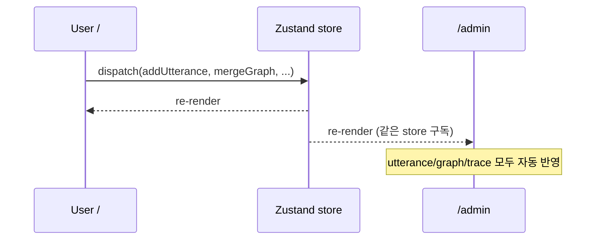

# 관리자 페이지 (NLU/온톨로지 관제 콘솔)

> **챗봇은 사용자 화면, 관리자 페이지는 "두뇌의 X-ray".**
> 사용자가 발화할 때마다, 관리자 페이지는 그 발화가 어떻게 **인텐트 분석** 되고
> **온톨로지 트리플** 로 변환되는지 실시간으로 시각화한다. (자동 갱신)

## 1. 목적

| # | 목적 | 효과 |
|---|---|---|
| 1 | 입코딩/데모 도중 LLM 추론을 "보이게" 만들기 | 심사위원에게 차별 포인트(온톨로지) 어필 |
| 2 | 프롬프트/스키마 튜닝 시 디버깅 | 잘못 분류된 인텐트를 즉시 발견 |
| 3 | 그래프 상태를 한 화면에서 점검 | 사이클/누락된 의존성 등 정합성 확인 |
| 4 | 데모용 "리플레이" | 저장된 발화 로그를 다시 돌려보기 |

## 2. 위치 & 접근
- 라우트: **`/admin`** (Next.js App Router).
- MVP에서는 인증 없음. `.env.local`의 `ADMIN_ENABLED=true` 일 때만 노출(프로덕션 가드).
- 사용자 화면(`/`)과 **같은 Zustand store** 를 구독하므로, 발화 즉시 자동 갱신.

## 3. 화면 레이아웃

```
┌─────────────────────────────────────────────────────────────────────────┐
│  🛠 Admin Console — 스케줄게이미피케이션                  [⏺ Live] [▶ Replay] │
├──────────────────────────────────────┬──────────────────────────────────┤
│ ① Utterance Timeline                 │ ② Intent Analyzer (latest)        │
│  [09:31] "내일 9시 헬스, 11시..."     │  intent:  add_schedule   conf:0.94 │
│  [09:34] "보고서 끝!"                  │  npcReply: "용사여, ..."          │
│  [09:36] "오늘 뭐 남았어?"             │  raw JSON ▾                       │
│  ...                                  │  prompt   ▾                       │
├──────────────────────────────────────┼──────────────────────────────────┤
│ ③ Ontology Graph (live)               │ ④ Triple Store (live)             │
│  ┌──────────────────────────────┐    │  task:t1  qlog:title   "헬스"      │
│  │  [mermaid live graph]        │    │  task:t1  qlog:start   "09:00"     │
│  │   T1 ──BEFORE──▶ T2          │    │  task:t1  qlog:atLoc   loc:gym     │
│  │   T2 ──AT_LOC──▶ Meeting     │    │  task:t2  qlog:priority "main"     │
│  └──────────────────────────────┘    │  ...                              │
├──────────────────────────────────────┼──────────────────────────────────┤
│ ⑤ Quest Build Trace                   │ ⑥ Validation / Warnings           │
│  buildQuests() 결과 단계별 로그       │  - cycle detected? ✅ none         │
│   step1: collect mains [t2]           │  - implicit order: +1 edge        │
│   step2: subs of t2  → [t3]           │  - unresolved time refs: 0        │
│   step3: sides → [t1, t4, t5]         │  - LLM retries: 0                 │
└──────────────────────────────────────┴──────────────────────────────────┘
```

## 4. 패널별 상세

### ① Utterance Timeline
- 시간 역순으로 발화 리스트 (가장 최근이 상단).
- 항목 클릭 시 ②~⑥ 패널이 **그 시점의 상태로 잠금**(스냅샷 모드).
- 각 항목에 인텐트 배지(컬러)와 처리 소요 시간(ms) 표시.

### ② Intent Analyzer
- **인텐트**: `add_schedule | complete_quest | skip_quest | next_quest | query | cancel`
- **신뢰도**: LLM에서 별도로 추출하거나, 규칙 기반 fallback의 매칭 점수.
- **raw JSON**: LLM이 돌려준 전체 응답을 syntax-highlight 으로.
- **prompt**: 시스템/사용자 프롬프트와 주입된 변수(`nowISO`, `tz`)를 그대로 노출.
- **재실행 버튼**: 같은 발화를 다시 추출 호출 → 결과 비교(좌/우 diff).

### ③ Ontology Graph (Live)
- Mermaid 또는 [react-flow] 로 그래프 시각화.
- 노드 색:
  - `Task` 노드는 priority(main=호박색 / side=초록), status(done=회색).
  - `Location` = 파랑, `Category` = 보라.
- 엣지 라벨: `BEFORE`, `AT_LOCATION`, `OF_CATEGORY`.
- 새 발화로 노드/엣지가 추가되면 0.4s 페이드 인 애니메이션.

### ④ Triple Store View
- `(subject, predicate, object)` 표 형식.
- 컬럼 필터/검색(predicate=`qlog:before` 만 보기 등).
- 우상단 `Export JSON` / `Copy as Turtle`.

### ⑤ Quest Build Trace
- `buildQuests(graph)` 가 어떤 단계를 거쳤는지 텍스트 로그로.
  ```
  [trace] mains found: [t2]
  [trace] subs of t2 via dependsOn: [t3]
  [trace] subs of t2 via implicit-time: []
  [trace] sides: [t1, t4, t5]
  [trace] active = quest(sub) "보고서 마무리"
  ```
- `getActiveQuest()` 가 선택한 이유(우선순위 점수표)도 표시.

### ⑥ Validation / Warnings
- 사이클 검출 결과, 자동 추가된 implicit BEFORE 엣지 수, 시간 미해결 수, LLM 재시도 횟수, 마지막 호출 응답 시간.

## 5. 자동 갱신 메커니즘



- **별도 WebSocket 불필요**: 같은 브라우저 탭/창의 React 트리 안에서 store만 공유하면 충분.
- 멀티 탭으로 시연하고 싶으면 `storage` 이벤트 + `zustand persist` 조합으로 동기화(옵션).

## 6. 디버그 정보 저장 모델

```ts
// lib/store/admin-log.ts
export interface UtteranceLog {
  id: string;
  ts: string;                 // ISO
  utterance: string;
  nowISO: string;
  tz: string;
  llm: {
    model: string;
    requestMs: number;
    rawResponse: unknown;     // SDK 원본 응답
    retries: number;
  };
  parsed: ExtractResult;      // zod 검증된 결과
  intent: ExtractResult['intent'];
  graphDiff: {
    addedTaskIds: string[];
    removedTaskIds: string[];
    addedEdges: Triple[];
  };
  questTrace: string[];
  activeQuestIdAfter: string | null;
}
```

- 메모리에 최근 50개 유지(circular buffer).
- `Export Logs` 버튼으로 JSON 다운로드 → 데모 후 분석/회고용.

## 7. Replay 모드
- 저장된 `UtteranceLog[]` 를 순서대로 재생(재호출 X, 캐시된 결과로 시각화).
- 데모 중 LLM이 흔들리면 안전망으로 사용.

## 8. 관리자 액션 (가벼움)
- `Reset Graph`: 그래프/퀘스트 초기화.
- `Seed Demo`: 미리 정의된 시나리오 1을 즉시 주입(데모용 원클릭).
- `Toggle MOCK_LLM`: 런타임에서 mock ↔ real 전환(개발 모드 한정).

## 9. 컴포넌트 매핑

| 컴포넌트 | 파일 |
|---|---|
| `AdminPage` | `app/admin/page.tsx` |
| `UtteranceTimeline` | `components/admin/UtteranceTimeline.tsx` |
| `IntentAnalyzer` | `components/admin/IntentAnalyzer.tsx` |
| `OntologyGraphView` | `components/admin/OntologyGraphView.tsx` |
| `TripleStoreTable` | `components/admin/TripleStoreTable.tsx` |
| `QuestBuildTrace` | `components/admin/QuestBuildTrace.tsx` |
| `ValidationPanel` | `components/admin/ValidationPanel.tsx` |
| `AdminToolbar` | `components/admin/AdminToolbar.tsx` |

## 10. 보안 가드
- `/admin` 라우트는 서버에서 `process.env.ADMIN_ENABLED === 'true'` 가 아니면 **404 반환**.
- 토글이 켜져 있어도 LLM 키/원본 프롬프트는 SDK 호출 메타데이터만 노출하고, **API 키는 절대 표시하지 않는다**.
- raw JSON 패널에 사용자 입력을 그대로 보여줄 때 XSS 방지를 위해 항상 `<pre><code>` 로 escape.

## 11. 데모 동선과의 연계

1. 발표자 화면을 **두 영역으로 분할**:
   - 왼쪽: `/` (사용자 챗봇)
   - 오른쪽: `/admin` (관제 콘솔)
2. 발화 한 번 → 양쪽이 동시에 갱신되며 "말 → 인텐트 → 온톨로지 → 퀘스트"의 전체 파이프라인을 한눈에 보여준다.
3. 심사위원에게 "단순 To-do가 아니라 의미 그래프"라는 점을 시각적으로 증명.
