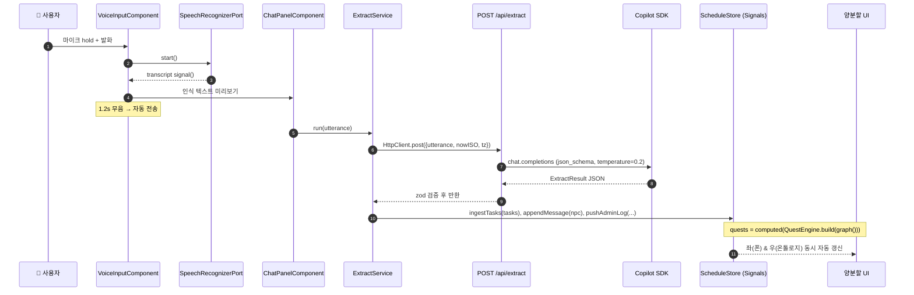
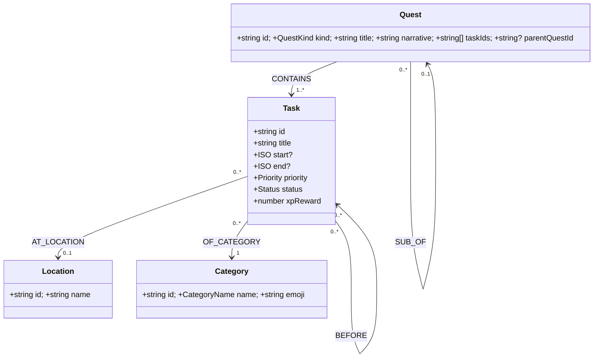
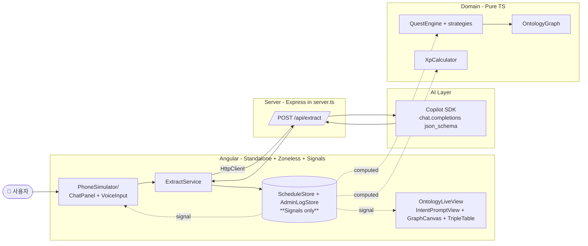

# 스케줄게이미피케이션 — 통합 설계서 (SPEC)

> **Single Source of Truth.** 이 문서 하나면 개발을 시작할 수 있다.
> 세부 보조 문서는 `00-overview.md ~ 11-angular-solid-guide.md` 에 동일 내용이 분할되어 있다.

---

## 0. 한눈에 보기

| 항목 | 결정 |
|---|---|
| 프로젝트명 | **스케줄게이미피케이션** (`schedule-gamification`) |
| 대회 주제 | 천하제일 입코딩 대회 — 개인 생산성 웹앱 |
| 한 줄 컨셉 | "발화로 일정을 던지면, 의도 분석 → 온톨로지 → RPG 퀘스트로 자동 변환" |
| 프레임워크 | **Angular 최신 (≥ 20)** Standalone, Zoneless, `@if`/`@for` |
| 상태관리 | **Angular Signals 전용** (`signal`/`computed`/`effect`/`linkedSignal`/`resource`) |
| 설계 원칙 | **SOLID** (Port/Adapter, InjectionToken DI) |
| LLM | **Copilot SDK** (서버에서만 호출, Structured Output) |
| 음성 입력 | Web Speech API → `SpeechRecognizerPort` 어댑터 |
| 데이터 저장 | 로컬 (LocalStorage 어댑터). DB 없음. |
| 배포 | Angular SSR + Express(`server.ts`) 단일 노드 서버 |
| UI 컨셉 | **좌: 스마트폰 시뮬레이터 안 챗봇** / **우: 자동 생성 온톨로지 라이브 뷰** |
| 개발 전략 | **UI-First** — 화면 골격 → 목 데이터 → Signal 연결 → LLM → 도메인 코어 |

---

## 1. 핵심 사용자 시나리오

> 사용자가 음성으로 말한다 →
> 챗봇이 답한다 →
> **동시에, 오른쪽 온톨로지 뷰가 자동으로 갱신된다.**
> 모든 것이 한 화면에서 라이브로 일어나는 게 차별 포인트.

### 시나리오 1 (등록)
> 🎤 *"내일 9시에 헬스 가고, 11시에 팀 미팅. 미팅 전에 보고서 마무리해야 해. 점심 먹고 도서관 가서 책 반납해줘."*

자동 추출 결과:
- Task 4개 (헬스 / 보고서 / 팀 미팅 / 도서관)
- 의존성: "보고서 → 팀 미팅" (BEFORE)
- 메인 퀘스트: 팀 미팅
- 서브 퀘스트: 보고서 마무리
- 사이드 퀘스트: 헬스, 책 반납

오른쪽 온톨로지 뷰가 즉시 노드 4개 + 엣지를 페이드인 애니메이션으로 표시.

### 시나리오 2 (진행)
> 🎤 *"보고서 끝!"*

- 활성 퀘스트가 `done` 처리, +30 XP, NPC: "퀘스트 클리어! 다음은 팀 미팅이라네."
- 온톨로지 뷰의 해당 노드가 회색으로.

### 시나리오 3 (조회)
> 🎤 *"오늘 뭐 남았어?"*

- 남은 퀘스트 요약 응답 + 온톨로지 뷰의 미완료 노드 하이라이트.

---

## 2. UI 설계 — 양분할 라이브 콘솔

> **한 화면**으로 모든 것을 보여준다. 별도 탭 이동 없음.

### 2.1 와이어프레임

```
┌─────────────────────────────────────────────────────────────────────────────┐
│  🛠 스케줄게이미피케이션         Lv.7 ████░░ 740/1000 XP    [⏺ Live]  [🔄] │
├──────────────────────────────────┬──────────────────────────────────────────┤
│                                  │                                          │
│   ┌─ 📱 PhoneFrame ─────────┐    │   📊 의도 분류 & 온톨로지 라이브 뷰      │
│   │  ┌──────────────────┐   │    │  ┌──────────────────────────────────┐    │
│   │  │ 🕘 09:42  🔋 ▓▓▓ │   │    │  │  [intent: add_schedule  conf:.94]│    │
│   │  ├──────────────────┤   │    │  │                                  │    │
│   │  │ 🧙 NPC:          │   │    │  │       (T1)─BEFORE──▶(T2 main)    │    │
│   │  │  "모험가여, 다음 │   │    │  │        헬스          팀 미팅      │    │
│   │  │   임무는..."     │   │    │  │           ╲         ╱             │    │
│   │  │                  │   │    │  │            ▽       ▽              │    │
│   │  │ 👤 You:          │   │    │  │          (Loc:헬스장)  (Loc:회의)│    │
│   │  │  "내일 9시 헬스"  │   │    │  │                                  │    │
│   │  │                  │   │    │  └──────────────────────────────────┘    │
│   │  │ 🧙 NPC:          │   │    │  ┌── 🧾 Triple Store (자동 갱신) ─────┐  │
│   │  │  "용사여..."      │   │    │  │ task:t1  qlog:title    "헬스"     │  │
│   │  │                  │   │    │  │ task:t1  qlog:start    "09:00"    │  │
│   │  │ [Active Quest]   │   │    │  │ task:t2  qlog:priority "main"     │  │
│   │  │ 🗡 보고서 마무리 │   │    │  │ ...                               │  │
│   │  │  마감 10:55 +30XP │   │    │  └───────────────────────────────────┘  │
│   │  │                  │   │    │  ┌── 🧠 Intent / Prompt / Raw JSON ──┐  │
│   │  │ ┌──────────────┐ │   │    │  │ ▶ intent: add_schedule            │  │
│   │  │ │ 메시지 입력   │ │   │    │  │ ▶ tasks: [...]                    │  │
│   │  │ └──────────────┘ │   │    │  │ ▶ npcReply: "용사여, ..."         │  │
│   │  │      🎤 [Hold]   │   │    │  │ ▶ prompt (clickable to expand)    │  │
│   │  └──────────────────┘   │    │  └───────────────────────────────────┘  │
│   │     PhoneFrame end     │    │                                          │
│   └────────────────────────┘    │                                          │
│                                  │                                          │
└──────────────────────────────────┴──────────────────────────────────────────┘
```

### 2.2 좌측: `PhoneSimulator`
- iPhone 14 비율(390 × 844). CSS로 둥근 모서리 + 다이내믹 아일랜드 흉내.
- 상단 상태바(시계/배터리/와이파이 아이콘 — 정적 SVG).
- 하단 마이크 버튼: **Push-to-Talk**. 누르고 있는 동안 펄스 애니메이션.
- 챗 영역: `ChatPanelComponent` (NPC / User / System 메시지 거품).
- 상단에 떠 있는 **Active Quest 카드** (현재 해야 할 퀘스트 1개를 강조).

### 2.3 우측: `OntologyLiveView`
3단 구성, 모두 같은 `ScheduleStore` 의 signal을 구독해 **자동 갱신**:

| 영역 | 표시 |
|---|---|
| ① Intent / Prompt / Raw JSON | 가장 최근 발화의 `intent`, LLM에 보낸 prompt, 받은 raw JSON (접고 펴기) |
| ② Graph Canvas | `Task`/`Location`/`Category` 노드 + `BEFORE`/`AT_LOCATION` 엣지. 신규 노드는 0.4s 페이드인. |
| ③ Triple Store Table | `(subject, predicate, object)` 표. 검색/필터. JSON 내보내기 버튼. |

### 2.4 반응형 / 폴백
- 가로 폭 ≥ 1100px: 양분할.
- 그 미만: 상하 스택(폰 위, 온톨로지 아래) + 상단 탭으로 빠른 토글.
- 음성 인식 미지원 브라우저: 마이크 버튼 비활성 + 키보드 입력 강조.

### 2.5 디자인 톤
- RPG 양피지 / 다크 패널 믹스. 폰은 라이트, 온톨로지는 다크.
- 컬러 토큰:
  - Main Quest `#F59E0B`, Sub `#3B82F6`, Side `#10B981`, Done `#9CA3AF`.
- 폰트: 시스템 산세리프 + 코드 영역은 `ui-monospace`.

---

## 3. UI-First 개발 로드맵

> **요청 사항: "화면을 가장 먼저 만든다."**
> 따라서 단계 0~3은 모두 **목 데이터 기반 정적 UI**. 단계 4부터 실제 데이터/AI 연결.

### 단계 0 — 프로젝트 부트스트랩 (10분)
- [ ] `ng new schedule-gamification --standalone --routing --style=css --ssr`
- [ ] Tailwind v4 설치 + 토큰 설정.
- [ ] `app.config.ts` 에 `provideZonelessChangeDetection`, `provideHttpClient(withFetch())`, `provideClientHydration` 등록.
- [ ] 라우트: `/` (`ChatPage`), `/admin` (별도 풀스크린 관제 — 옵션). 양분할 메인은 `/`.

**완료 기준**: `npm start` 가 빈 양분할 레이아웃을 띄운다.

### 단계 1 — 양분할 정적 레이아웃
- [ ] `LiveConsolePage` (= `app.routes.ts` 의 기본 라우트) 작성.
- [ ] CSS Grid `grid-template-columns: 420px 1fr;` 로 좌/우 고정.
- [ ] 좌측에 `PhoneFrameComponent` (단순 div, 라운드 + 그림자 + 상태바 SVG).
- [ ] 우측에 `OntologyLiveViewComponent` (빈 placeholder 3섹션).

**완료 기준**: 폰 모양 박스 + 우측 패널 골격이 화면에 보인다.

### 단계 2 — 폰 안 챗 UI (목 데이터)
- [ ] `ChatPanelComponent`: 메시지 목록 `input<ChatMessage[]>()` 으로 받음. NPC/User/System 스타일 분기.
- [ ] `ChatBubbleComponent`, `ActiveQuestHeroComponent`.
- [ ] `VoiceInputComponent`: 마이크 아이콘 버튼 + 펄스 애니메이션. 클릭 시 콘솔 로그만.
- [ ] **하드코딩 메시지 4~5개**로 화면을 채워서 "그림이 완성된" 상태로 만든다.

**완료 기준**: 폰 안에 챗 대화가 실제 앱처럼 보인다. 인터랙션은 아직 없음.

### 단계 3 — 온톨로지 라이브 뷰 (목 데이터)
- [ ] `IntentPromptViewComponent`: 접힘/펼침 카드 3개(intent, prompt, raw JSON).
- [ ] `OntologyGraphCanvasComponent`: SVG 또는 Mermaid 라이브 렌더 (`<pre class="mermaid">{{ src() }}</pre>` + `mermaid.init` in `effect`).
- [ ] `TripleStoreTableComponent`: `(s,p,o)` 표. 검색 인풋(signal-binding `model()`).
- [ ] **시나리오 1 의 결과를 그대로 하드코딩** 해 노드 4개 + 엣지를 렌더.

**완료 기준**: 좌측 폰의 메시지 + 우측의 그래프/표가 "발표 사진"으로 써도 될 정도로 완성.

### 단계 4 — Signal Store 연결 (목 데이터 → 시그널 흐름)
- [ ] `ScheduleStore` (`signal`/`computed`) 구현, 처음에는 **목 데이터를 store 초기값**으로 주입.
- [ ] 모든 컴포넌트가 `input` 대신 `inject(ScheduleStore)` 로 signal 구독하게 전환.
- [ ] 폰의 텍스트 입력창에 글을 쓰면 **임의의 mock task 1개를 store에 push** → 양쪽이 동시에 갱신되는 모습 확인.

**완료 기준**: 텍스트 한 줄 입력 = 좌/우 동시 갱신. 시각적 임팩트 확보.

### 단계 5 — 음성 입력
- [ ] `SpeechRecognizerPort` + `WebSpeechRecognizer` 어댑터 (`signal<transcript>`, `signal<state>`).
- [ ] `VoiceInputComponent`: 누르고 있는 동안 `start()`, 떼면 `stop()`. 인식 결과를 `ChatPanel` 입력칸 미리보기 → 1.2s 무음 시 자동 전송.
- [ ] 비지원 브라우저: 마이크 비활성 + 텍스트 사용 안내 토스트.

**완료 기준**: 발화 → 자동 텍스트 → store 반영(아직은 추출 없이 그대로 task로 더하기는 OK).

### 단계 6 — Copilot SDK 연동 (실제 의도 분류)
- [ ] 서버: `server.ts` 에 `POST /api/extract` 추가.
- [ ] `server/copilot/copilot.client.ts` 싱글톤.
- [ ] `server/copilot/extract.schema.ts` 단일 zod → JSON Schema 동시 노출.
- [ ] `LLM_EXTRACTOR` 포트에 `CopilotExtractor`(HttpClient → /api/extract) 구현.
- [ ] `MOCK_LLM=true` 환경에서는 `MockExtractor` 어댑터로 자동 폴백.
- [ ] `ExtractService.run(utterance)` → `ScheduleStore.ingestTasks(tasks)`. 우측 패널의 intent/prompt/JSON/그래프/triple 이 모두 자동 갱신.

**완료 기준**: 시나리오 1 발화 → 4개 task 자동 추출 + 양쪽 모두 라이브 갱신.

### 단계 7 — 게이미피케이션
- [ ] `XpCalculator` + `ScheduleStore.completeQuest()`.
- [ ] Active Quest 카드의 "완료" 버튼, "끝!" 발화 인식 → `complete_quest` intent로 매핑.
- [ ] 레벨업 시 토스트 + NPC 시스템 메시지 + 캐릭터 카드 깜빡임.

### 단계 8 — NPC 톤 & 폴리시 & 데모 리허설
- [ ] Active Quest 글로우 + 카운트다운, 칭호 1~2개, (옵션) 사운드.
- [ ] **시나리오 1~3** 3회 리허설. `MOCK_LLM=true` 백업 시연 확인.

> 시간 부족 시 컷 가능: 단계 7의 칭호/사운드. 단계 5는 텍스트 데모로 대체 가능.

---

## 4. 음성 입력 → 자동 의도 분류 → 온톨로지 흐름



**중요 보장**:
1. 음성 인식 자체는 클라이언트(Web Speech) — 외부 의존성 X.
2. LLM 호출은 **반드시 서버 측 `/api/extract`** — Copilot API 키가 브라우저 번들에 절대 노출되지 않는다.
3. 추출 결과는 **하나의 Signal Store** 로 합쳐져, 좌/우 패널이 같은 진실 공급원을 구독한다 → "자동으로 관리자에 있는 온톨로지로 분류"가 구조적으로 보장됨.

---

## 5. Copilot SDK 사용 가이드 (Q: "코파일럿 SDK 쓰면 되는거야?")

### A: 네. 다음과 같이 사용합니다.

**서버 측에서만** Copilot SDK의 Chat Completion + Structured Output을 1회 호출하여
`{intent, tasks[], npcReply}` 를 한 번에 받습니다.

```ts
// server/api/extract.handler.ts (Express handler)
import type { RequestHandler } from 'express';
import { getCopilot } from '../copilot/copilot.client';
import { extractSchema, extractSchemaZ } from '../copilot/extract.schema';
import { SYSTEM_PROMPT, userPrompt } from '../copilot/extract.prompt';
import { z } from 'zod';

const ReqZ = z.object({
  utterance: z.string().min(1).max(500),
  nowISO:    z.string(),
  tz:        z.string(),
});

export const extractHandler: RequestHandler = async (req, res) => {
  const parsed = ReqZ.safeParse(req.body);
  if (!parsed.success) return res.status(400).json({ error: 'BAD_REQUEST' });

  const { utterance, nowISO, tz } = parsed.data;
  try {
    const copilot = getCopilot();
    const completion = await copilot.chat.completions.create({
      messages: [
        { role: 'system', content: SYSTEM_PROMPT },
        { role: 'user',   content: userPrompt({ utterance, nowISO, tz }) },
      ],
      response_format: {
        type: 'json_schema',
        json_schema: { name: 'ExtractResult', schema: extractSchema, strict: true },
      },
      temperature: 0.2,
    });
    const raw = completion.choices[0]?.message.content ?? '{}';
    const result = extractSchemaZ.parse(JSON.parse(raw));
    return res.json(result);
  } catch (err) {
    return res.status(502).json({ error: 'LLM_FAILED' });
  }
};
```

> **패키지명/모델명**은 대회에서 안내한 SDK 문서 기준으로 `getCopilot()` 내부 import만 교체.
> 우리 코드는 `LlmExtractorPort` 라는 추상화 뒤에 격리해 두었기 때문에 **호출부는 수정 불필요**.

### 단일 zod 스키마 → 모든 곳에서 재사용

```ts
// server/copilot/extract.schema.ts
import { z } from 'zod';
import { zodToJsonSchema } from 'zod-to-json-schema';

export const extractSchemaZ = z.object({
  intent: z.enum(['add_schedule','complete_quest','skip_quest','next_quest','query','cancel']),
  tasks: z.array(z.object({
    title: z.string(),
    start: z.string().nullable(),
    end:   z.string().nullable(),
    location: z.string().nullable(),
    priority: z.enum(['main','side']),
    category: z.enum(['work','health','study','errand','personal']),
    dependsOnTitles: z.array(z.string()).default([]),
  })),
  npcReply: z.string(),
});
export type ExtractResult = z.infer<typeof extractSchemaZ>;
export const extractSchema = zodToJsonSchema(extractSchemaZ, 'ExtractResult');
```

이 한 정의가:
- Copilot SDK의 `response_format.json_schema` 에 주입되고,
- 서버에서 응답을 한 번 더 zod 검증하고,
- 클라이언트가 `ExtractResult` 타입을 그대로 import 한다.

### 시스템 프롬프트 (요약)

```
You are 스케줄게이미피케이션's schedule parser. The user speaks Korean.
- Output ONLY valid JSON matching the provided JSON Schema.
- Resolve relative time using nowISO/tz.
- A single utterance can contain multiple tasks.
- Infer dependsOnTitles from "...전에", "...끝나고" 등.
- priority="main" for meetings/deadlines/appointments; "side" otherwise.
- category: work | health | study | errand | personal.
- npcReply: NPC tone, address user as 모험가/용사, one short Korean sentence.
- If intent is not add_schedule, set tasks=[].
```

### 보안 체크리스트
- [ ] `COPILOT_API_KEY` 는 서버 환경 변수에만 존재. 클라이언트 번들에 절대 포함 X.
- [ ] 클라이언트는 항상 `/api/extract` 만 호출.
- [ ] 사용자 입력 길이 제한(500자) + zod 검증.
- [ ] LLM 응답 JSON 파싱 실패 시 1회 재시도 → 그래도 실패면 사용자에게 일반화된 오류 메시지.
- [ ] `MOCK_LLM=true` 일 때 오프라인 폴백.

---

## 6. 온톨로지 설계 (도메인 코어)

### 6.1 클래스 다이어그램



### 6.2 TypeScript 타입 (도메인 단일 출처)

```ts
// src/app/domain/types.ts
export type Priority = 'main' | 'side';
export type Status = 'pending' | 'active' | 'done' | 'skipped';
export type CategoryName = 'work' | 'health' | 'study' | 'errand' | 'personal';

export interface Task {
  id: string;
  title: string;
  start?: string;
  end?: string;
  priority: Priority;
  status: Status;
  categoryId: string;
  locationId?: string;
  dependsOn: string[];
  xpReward: number;
  createdAt: string;
}
export interface Location { id: string; name: string; }
export interface Category { id: string; name: CategoryName; emoji: string; }

export type QuestKind = 'main' | 'sub' | 'side';
export interface Quest {
  id: string;
  kind: QuestKind;
  title: string;
  narrative: string;
  taskIds: string[];
  parentQuestId?: string;
}
```

### 6.3 트리플 표현 (관리자 뷰의 ③ 표)

```
(task:t1, qlog:title,    "보고서 마무리")
(task:t1, qlog:end,      "2026-06-21T10:55+09:00")
(task:t1, qlog:before,   task:t2)
(task:t2, qlog:title,    "팀 미팅")
(task:t2, qlog:priority, "main")
(task:t2, qlog:atLoc,    loc:meeting_room_A)
```

### 6.4 퀘스트 변환 규칙
1. `priority='main'` 인 Task는 `Main Quest`로 승격.
2. Main Task에 `dependsOn` 또는 시간상 직전인 Task는 같은 라인의 `Sub Quest`로 편입.
3. 그 외 Task는 각각 `Side Quest`.
4. `getActiveQuest(now)`: 시작 ≤ now+30m, 의존성 모두 done, 우선순위 `sub > main > side`.

### 6.5 정합성 규칙
| 규칙 | 처리 |
|---|---|
| 사이클 금지 | `dependsOn` 추가 시 DFS 검출 → 거부 |
| 시간 모순 | 의존성 우선, 경고 로그 |
| 장소 정규화 | trim + lowercase → 동일 Location id |
| 카테고리 미분류 | `personal` 기본값 |

---

## 7. 챗봇 대화 흐름

### 7.1 인텐트
| 인텐트 | 예 | 처리 |
|---|---|---|
| `add_schedule` | "내일 9시 헬스" | 추출 → graph upsert |
| `complete_quest` | "끝", "완료" | 활성 퀘스트 done + XP |
| `skip_quest` | "패스", "건너뛰어" | skipped |
| `next_quest` | "다음", "뭐 하지" | `getActiveQuest` 재계산 |
| `query` | "오늘 뭐 남았어?" | 남은 퀘스트 요약 |
| `cancel` | "취소" | 가장 최근 추가 task 제거 |

### 7.2 NPC 톤
- 사용자를 "모험가" / "용사" 로 호명.
- 1~2문장 한국어.
- 시간/장소가 있으면 반드시 언급.
- 끝에 콜투액션 1줄.

> "용사여, 11시까지 회의실 A로 향하라. 그 전에 보고서 두루마리를 완성해야 한다네."

### 7.3 게이미피케이션 (요약)
| Quest | XP | 비고 |
|---|---|---|
| Side | 10 | 시간 내 완료 +20% |
| Sub | 30 | 동일 |
| Main | 100 | 동일 |

레벨 곡선: `xpForLevel(L) = 100L + 50·L·(L-1)`.

---

## 8. 시스템 아키텍처



### 레이어 (SOLID)
| 레이어 | 의존성 |
|---|---|
| UI Components (`features/**`) | → State Store, Service |
| Signal Store (`state/**`) | → Domain, Ports |
| Use-case Service (`services/**`) | → Domain, Ports |
| Domain (`domain/**`) | 의존 없음 (순수 TS) |
| Ports (`ports/**`) | 의존 없음 (인터페이스 + InjectionToken) |
| Adapters (`adapters/**`) | → Ports 구현 |
| Server (`server/**`) | Node 전용, 시크릿 사용 가능 |

---

## 9. 폴더 구조

```
schedule-gamification/
├─ src/
│  ├─ main.ts
│  ├─ index.html
│  ├─ styles.css
│  ├─ environments/
│  │  ├─ environment.ts
│  │  └─ environment.development.ts
│  └─ app/
│     ├─ app.ts
│     ├─ app.config.ts          # DI 등록 (포트 → 구현)
│     ├─ app.config.server.ts
│     ├─ app.routes.ts
│     │
│     ├─ domain/
│     │  ├─ types.ts
│     │  ├─ ontology.ts
│     │  ├─ quest-engine.ts
│     │  ├─ quest-strategies/
│     │  │  ├─ main-quest.strategy.ts
│     │  │  ├─ sub-quest.strategy.ts
│     │  │  └─ side-quest.strategy.ts
│     │  └─ xp.ts
│     │
│     ├─ ports/
│     │  ├─ llm-extractor.port.ts
│     │  ├─ clock.port.ts
│     │  ├─ speech.port.ts
│     │  └─ persistence.port.ts
│     │
│     ├─ adapters/
│     │  ├─ copilot-extractor.adapter.ts
│     │  ├─ mock-extractor.adapter.ts
│     │  ├─ system-clock.adapter.ts
│     │  ├─ web-speech.adapter.ts
│     │  └─ local-storage.adapter.ts
│     │
│     ├─ state/
│     │  ├─ schedule.store.ts     # Signal-only
│     │  └─ admin-log.store.ts
│     │
│     ├─ services/
│     │  ├─ extract.service.ts
│     │  └─ quest.service.ts
│     │
│     └─ features/
│        ├─ live-console/            # ⭐ 메인 라우트 (양분할)
│        │  ├─ live-console.page.ts
│        │  └─ live-console.page.html
│        ├─ chat/
│        │  ├─ phone-frame.component.ts
│        │  ├─ chat-panel.component.ts
│        │  ├─ chat-bubble.component.ts
│        │  ├─ voice-input.component.ts
│        │  ├─ active-quest-hero.component.ts
│        │  └─ character-card.component.ts
│        └─ ontology/                # ⭐ 우측 패널
│           ├─ ontology-live-view.component.ts
│           ├─ intent-prompt-view.component.ts
│           ├─ ontology-graph-canvas.component.ts
│           └─ triple-store-table.component.ts
│
├─ server.ts
├─ server/
│  ├─ api/
│  │  └─ extract.handler.ts
│  └─ copilot/
│     ├─ copilot.client.ts
│     ├─ extract.prompt.ts
│     └─ extract.schema.ts
│
├─ public/
│  ├─ npc-avatar.svg
│  └─ sfx/{ding.mp3,levelup.mp3}
├─ docs/
├─ .env.example
├─ angular.json
├─ tsconfig.json
└─ package.json
```

---

## 10. Signal Store 핵심 예시

```ts
// src/app/state/schedule.store.ts
import { Injectable, computed, effect, inject, signal } from '@angular/core';
import { CLOCK } from '../ports/clock.port';
import { OntologyGraph } from '../domain/ontology';
import { QuestEngine }   from '../domain/quest-engine';
import { XpCalculator }  from '../domain/xp';
import type { ChatMessage, Quest, Task } from '../domain/types';

@Injectable({ providedIn: 'root' })
export class ScheduleStore {
  private readonly clock = inject(CLOCK);

  // --- 내부 writable ---
  private readonly _graph    = signal<OntologyGraph>(OntologyGraph.empty());
  private readonly _messages = signal<ChatMessage[]>([]);
  private readonly _xp       = signal(0);

  // --- readonly 노출 ---
  readonly graph    = this._graph.asReadonly();
  readonly messages = this._messages.asReadonly();
  readonly xp       = this._xp.asReadonly();

  // --- computed 파생 ---
  readonly quests      = computed(() => QuestEngine.build(this._graph()));
  readonly activeQuest = computed<Quest | null>(() =>
    QuestEngine.pickActive(this.quests(), this.clock.now())
  );
  readonly level    = computed(() => XpCalculator.levelFor(this._xp()));
  readonly xpToNext = computed(() => XpCalculator.toNext(this._xp()));

  constructor() {
    effect(() => {
      const snap = this._graph().toJSON();
      localStorage.setItem('schedule:graph', JSON.stringify(snap));
    });
  }

  ingestTasks(drafts: Task[]) { this._graph.update(g => g.upsertMany(drafts)); }
  appendMessage(m: ChatMessage){ this._messages.update(l => [...l, m]); }
  completeQuest(questId: string) {
    const q = this.quests().find(x => x.id === questId);
    if (!q) return;
    this._graph.update(g => g.markTasksDone(q.taskIds));
    this._xp.update(v => v + XpCalculator.reward(q.kind));
  }
}
```

### 절대 금지 (안티패턴)
| ❌ | ✅ |
|---|---|
| `new BehaviorSubject` 로 상태 보관 | `signal()` |
| 컴포넌트가 `HttpClient` 직접 호출 | 서비스에 위임 |
| `*ngIf` / `*ngFor` | `@if` / `@for` |
| `NgModule` | Standalone + `app.config.ts` |
| `EventEmitter` | `output<T>()` |
| 거대한 God Service | 포트 단위 어댑터 + 작은 use case |

---

## 11. 서버 API

### `POST /api/extract`
**Request**
```json
{ "utterance": "내일 9시 헬스...", "nowISO": "2026-06-20T14:32:11+09:00", "tz": "Asia/Seoul" }
```
**Response 200**
```json
{
  "intent": "add_schedule",
  "tasks": [
    { "title":"헬스", "start":"2026-06-21T09:00:00+09:00", "end":null,
      "location":null, "priority":"side", "category":"health", "dependsOnTitles":[] }
  ],
  "npcReply": "용사여, 내일의 임무를 새겼다네."
}
```
| 코드 | 의미 |
|---|---|
| 400 | utterance 누락/너무 김 |
| 422 | LLM 응답 JSON 검증 실패 |
| 502 | Copilot SDK 호출 실패 |

> MVP에서는 서버를 **stateless** 로 유지. 그래프 머지/퀘스트 빌드는 모두 클라이언트 도메인 코어에서 수행.

---

## 12. 환경 변수

```
# Copilot SDK (서버에서만 사용)
COPILOT_API_KEY=
COPILOT_MODEL=gpt-4o-mini

# 데모/개발
MOCK_LLM=false

# 관리자 라우트 노출
ADMIN_ENABLED=true
```

---

## 13. 리스크 & 대응

| 리스크 | 대응 |
|---|---|
| LLM 응답 JSON 깨짐 | json_schema + zod 2중 검증 + 1회 재시도 |
| 시연장 네트워크 불안 | `MOCK_LLM=true` 폴백 |
| 음성 인식 실패 | 텍스트 입력 항상 노출 |
| 타임존 오류 | `nowISO`+`tz` 항상 전송, 서버에서 사용 |
| 입코딩 오타 | strict TS + 짧은 함수(≤30줄) + 자주 `ng build` |

---

## 14. 성공 지표 (데모)

1. **한 문장 발화 → 좌(폰) & 우(온톨로지) 동시 갱신** (시나리오 1).
2. **"끝!" 한 마디로 XP 획득 + 캐릭터 카드 변화** (시나리오 2).
3. **시각적 차별점**: 단순 To-do가 아니라 "발화 → 의도 → 트리플 → 그래프 → 퀘스트" 가 한 화면에 펼쳐짐.

---

## 부록 A. 보조 문서 인덱스
| 파일 | 상세 |
|---|---|
| [00-overview.md](00-overview.md) | 개요 |
| [01-requirements.md](01-requirements.md) | 요구사항 (FR/NFR) |
| [02-architecture.md](02-architecture.md) | 아키텍처 다이어그램 |
| [03-ontology-design.md](03-ontology-design.md) | 온톨로지 세부 |
| [04-gamification-ux.md](04-gamification-ux.md) | UX/UI 톤 |
| [05-chatbot-flow.md](05-chatbot-flow.md) | 대화 흐름/프롬프트 |
| [06-api-spec.md](06-api-spec.md) | API 명세 |
| [07-copilot-sdk-integration.md](07-copilot-sdk-integration.md) | Copilot SDK 통합 |
| [08-tech-stack.md](08-tech-stack.md) | 기술 스택/폴더 구조 |
| [09-roadmap.md](09-roadmap.md) | 단계별 로드맵 |
| [10-admin-page.md](10-admin-page.md) | 관리자 콘솔 |
| [11-angular-solid-guide.md](11-angular-solid-guide.md) | Angular + SOLID + Signals 코딩 원칙 |

> 본 문서(`SPEC.md`)가 충돌이 있을 경우 **이 문서가 우선**한다.
